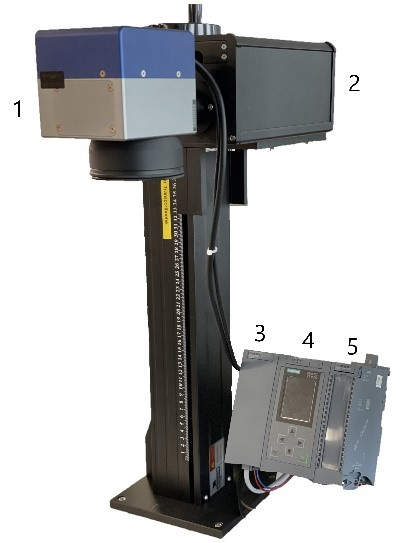
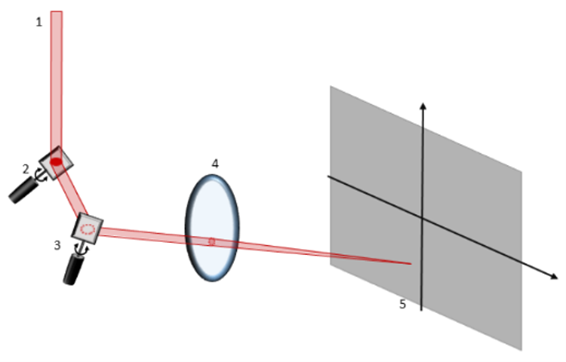

# Laser Scanner Example Logic for S7-1500 TM FAST Module

## Functional Description

In the application, a laser scanner is operated with the aid of the TM FAST. 
The TM FAST takes over the signal generation for the XY2-100 protocol, which is required for the communication between the module and the scan head. 
The VHDL App takes the coordinates from a constants array **DATA_MAN**, store them in the RAM  of the FPGA and calculate the linear interpolated values in between the next coordinates. 
In this example we use simple coordinates for a triangle as constants. 
The main function of the interpolation is to fit the scanner head mechanic specifications.
The optimized set points for X and Y of the laser is transfered to the scan head every 10us using XY2-100 Protocol at the RS422 onboard outputs.

Figure 1 below shows the setup. 
 
This consists of the innoSCAN II-10 scan head with F-Theta lens (1), the ILM12 F-D-635-1C-F industrial laser (2), 
a power module (3), the CPU 1516-3 PN/DP (4) and the TM FAST module (5). 

The functional principle of the scan head is illustrated in Figure 2 below. 
 
The galvanoscanner system consists of two mirrors for aligning the laser beam in the X and Y directions and an F-theta lens that proportionally 
offsets the incident laser beam and places it on a writing field. 
Data is transmitted using the XY2-100 protocol. This consists of four parallel transmission processes. A SYNC is sent in addition to the CLK. 
This signals the start and end of the transmission with a rising and falling edge. 

Data is transmitted via a Sub-D 25 socket. On the TM FAST, the connection is made to the RS422 channels CH0, CH1, CH4 and CH5. The CLK is transmitted with CH0+/-, the SYNC with CH1+/-, X with CH4+/- and Y with CH5+/-.  The supply voltage of the laser is switched via the DIQ(11) output.

## Program in Intel Quartus Prime
The top entity is TFL_FAST_USER_e. This forms the interface between the logic and the peripherals.  
The architecture TFL_FAST_USER_LASER_a describes the behaviour of the logic. This is based on several different components, which are listed in Table 3 below.  
In TFL_FAST_USER_IP_CONF_LASER_MP_FAST_1_p, configurations are set with regard to the clock (50 MHz) or the RS422 channels. 

### Control Interface
The logic use 1 register to setup the Laser output. The registers can be changed in the logic. In our example we use CTRL_IF0 for the SETUP parameters.

<table>
  <tr>
    <th>Register</th>
    <th colspan="8" style="text-align: right">Byte3</th>
    <th colspan="8" style="text-align: right">Byte2</th>
    <th colspan="8" style="text-align: right">Byte1</th>
    <th colspan="8" style="text-align: right">Byte0</th>
  </tr>
  <tr>
    <td>CTRL_IF0</td>
    <td colspan="24" style="text-align: center">-</td>
    <td colspan="1" style="text-align: center">-</td>
    <td colspan="1" style="text-align: center">-</td>
    <td colspan="1" style="text-align: center">-</td>
    <td colspan="1" style="text-align: center">-</td>
    <td colspan="1" style="text-align: center">-</td>
    <td colspan="1" style="text-align: center">CLEAR</td>
    <td colspan="1" style="text-align: center">-</td>
    <td colspan="1" style="text-align: center">START_BIT</td>
  </tr>
  <tr>
</table>

CLEAR : Aysnchrone Reset.  
START_BIT : Start and stop of transmission.

### Feedback Interface
Can be read back in the feedback interface:
the FB_IF1(10 downto 0) are displaying the address memory in the RAM where the coordinates FB_IF4(31 downto 0) are written.
<table>
  <tr>
    <th>Register</th>
    <th colspan="8" style="text-align: right">Byte3</th>
    <th colspan="8" style="text-align: right">Byte2</th>
    <th colspan="8" style="text-align: right">Byte1</th>
    <th colspan="8" style="text-align: right">Byte0</th>
  </tr>
  <tr>
    <td>FB_IF1</td>
    <td colspan="8" style="text-align: center">-</td>
    <td colspan="8" style="text-align: center">-</td>
    <td colspan="6" style="text-align: center">-</td>
    <td colspan="10" style="text-align: center">Memory Address</td>
  </tr>
  <tr>
    <td>FB_IF4</td>
    <td colspan="16" style="text-align: center">DATA_X</td>
    <td colspan="16" style="text-align: center">DATA_Y</td>
  </tr>
  <tr>
</table>

## Requirement
the following VHDL source files must be imported in the Quartus project in order to run the Logic.

| Component                         	 |Function   	                          |
|   ---                                  |  ---                                   |
|TFL_FAST_USER_IP_CONF_LASER_MP_FAST_1_p | Package configuration                  |
|TFL_FAST_USER_LASER_a                   | Main Architecture                      |
|TFL_FAST_USER_LASER_XY2_ea              | Control of transmission protocol       |
|TFL_FAST_USER_LASER_XY2_FSM_ea          | State machine of transmission protocol |
|TFL_FAST_USER_LASER_Interpolation_ea    | Control Data transfer between RAM and interpolation |
|TFL_FAST_USER_LASER_FSM_Bresenham_ea    | State machine of the interpolation (timing)   |
|TFL_FAST_USER_LASER_Bresenham_ea        | Carrying out interpolation using an algorithm |
|TFL_FAST_USER_LASER_Data_ea             | Control read and write access to RAM memory   |
|TFL_FAST_USER_LASER_Reg_ea              | Writing register     |
|TFL_FAST_USER_LASER_Parity_ea           | Parity Calculation   |
|TFL_FAST_USER_LASER_Edge_adv_ea         | Edge detection       |
|OnePortRam.qip                          | instantiated RAM     |
|Laser_app_clk.sdc                       | CLK_2MHZ constraints |

Note: if your are using other I/O than the one quoted in the description you need to make some changes in the top architecture and in the timing constraints file for the output CLK_2MHZ.

## Installation

1.  Download the system logic under https://support.industry.siemens.com/cs/ww/en/view/109817062
2.	Download the example logic files.
3.	Open the Quartus project: TFL_MP_FAST_1.qpf and replace the existing architecture TFL_FAST_USER_EXAMPLE_HELLO_WORLD_a.vhd with all the above files.  
4.	Rename the Application and Logic version in TFL_FAST_USER_IP_CONF_LASER_MP_FAST_1_p.vhd according to your requirements.
5.	Run compilation process.

## History

LaserScanner App V1.0: First released Version.
