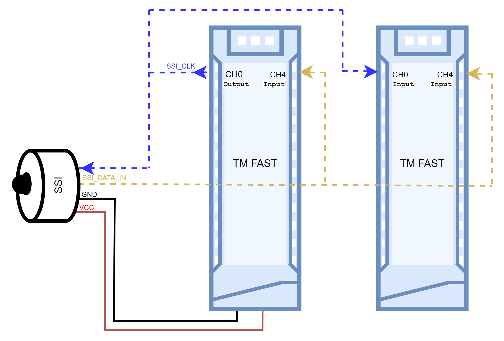

#	SSI Listen-In Encoder  (SSI) example logic for S7-1500 TM FAST Module

There are times when you must be able to read the encoder that is being controlled by another device.  In these times you use this library component to “Listen-In”. The example is designed to allow the reading of encoder using the **TM FAST** Module.  In order to read the proper value sent by the Encoder, the module listening has to use the exact same configuration than the other components. 
For basic information on the TM FAST Module see [here](https://support.industry.siemens.com/cs/ww/en/view/109817062).

## Description

This example shows the use of an SSI Listen-In encoder in conjunction with the TM FAST module.  

NO termination resistor should be activated on the Module listening to the SSI Encoder. There is usely already a resistor in the SSI Encoder CLK Input.
  

| Parameter             |Data type| Description                         |
|   ---                 |  ---    |     ---                             |
| SSI_CLOCK_RX          |  Int range 0 to 7    | SSI clock input  **0 -> CH0**  |
| SSI_DATA_IN_RX        |  Int range 0 to 7   | SSI data input  **4 -> CH4**     |
| COUNT_BIT_WIDTH       |  Int    | SSI whole frame length **16bits**   |
| FRAME_BIT_WIDTH       |  Int    | SSI position value length **13bits**|
| CLOCKSEL              |  Int    | SSI Baudrate Selection:   **0** ->  125KHz   1 -> 250KHz   2 -> 500KHz   3 -> 1MHz|
| MONOFLOPSEL           |  Int    | SSI Monoflop Selection:  **0** ->  16us   1 -> 32us   2 -> 48us   3 -> 64us|
| GREY_BIN_N_CTRL       |  BOOL   | Signal Encoding  :   **0** -> Gray Code to Absolute Binary    1 -> no conversion|
| FB_IF_SSI_VAL         |  Int (0 to 7)   | FB_IF DWord selection for the Position Value :  **0** -> DWord0  |
| FB_IF_DATAAVAILABLE_W |  Int (0 to 7)   | FB_IF DWord address selection for DATAAVAILABLE :  **1** -> DWord1 |
| FB_IF_DATAAVAILABLE_B |  Int (0 to 31)   | FB_IF bit selection for DATAAVAILABLE   :  **0** -> bit 0 |
| FB_IF_FRAME_OVERRUN_W |  Int (0 to 7)   | FB_IF DWord address selection for FRAME_OVERRUN :  **1** -> DWord1  |
| FB_IF_FRAME_OVERRUN_B |  Int (0 to 31)   | FB_IF bit selection for FRAME_OVERRUN  :  **1**  -> bit 1|
| SHIFT_DIR             |  string           | Justification :   - **"right"**   - "left"|
| SHIFT_COUNT           |  Int (0 to FRAME_BIT_WIDTH - 1)   | Number of bits to shift:  **0** |

The following values are returned by the encoder in the feedback interface.  

<table>
  <tr>
    <th>FB_IF</th>
    <th colspan="8">Byte3</th>
    <th colspan="8">Byte2</th>
    <th colspan="8">Byte1</th>
    <th colspan="8" style="text-align: right">Byte0</th>
  </tr>
  <tr>
    <td>*DWord0</td>
    <td colspan="32"  style="text-align: center">ENCODERCOUNT</td>
  </tr>
  <tr>
    <td>*DWord1</td>
    <td colspan="8"></td> 
    <td colspan="8"></td> 
    <td colspan="8"></td> 
    <td></td> 
    <td></td>
    <td></td>
    <td></td>
    <td></td>
    <td></td>
    <td>FRAME_OVERRUN</td>
    <td>DATAVAAILABLE</td>
  </tr>
</table>

*Default Setting

## Requirement

To use the logic example, you need to download the architecture and the package associated as well as the Quartus Project.
 
 -	TFL_MP_FAST_1.qpf (provided with the system logic)
 -  TFL_FAST_USER_LIB.qip
 -	TFL_FAST_USER_EXAMPLE_SSI_ListenIn_a.vhd
 -  TFL_FAST_USER_EXAMPLE_SSI_ListenIn_p.vhd

## Installation

1.  Download the system logic under https://support.industry.siemens.com/cs/ww/en/view/109817062
2.	Download the example logic files.
3.	Open the Quartus project: TFL_MP_FAST_1.qpf and replace the existing architecture with TFL_FAST_USER_EXAMPLE_SSI_ListenIn_a.vhd.  
    Don't forget to add the package TFL_FAST_USER_EXAMPLE_SSI_ListenIn_p.vhd in the project as well.
4.	Rename the Application and Logic version in TFL_FAST_USER_IP_CONF_PUBLIC_MP_FAST_1_p.vhd
5.	Run Compilation Process.

## History

SSI Example V1.0: First released Version.
