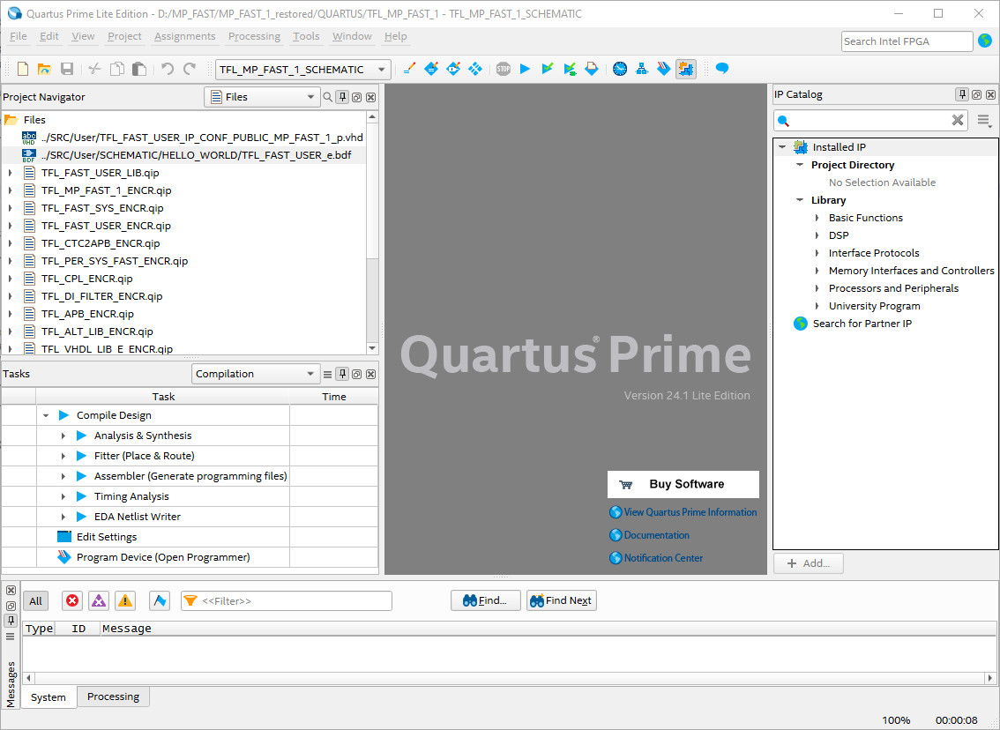
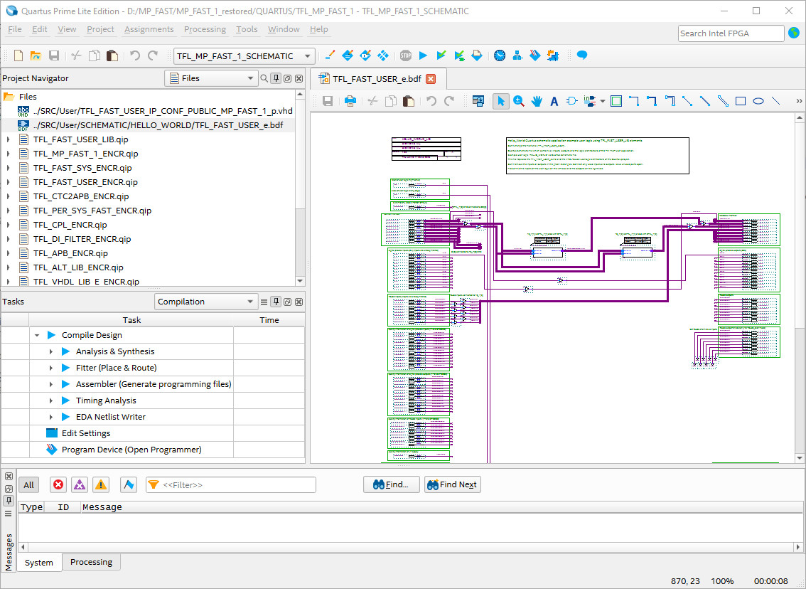
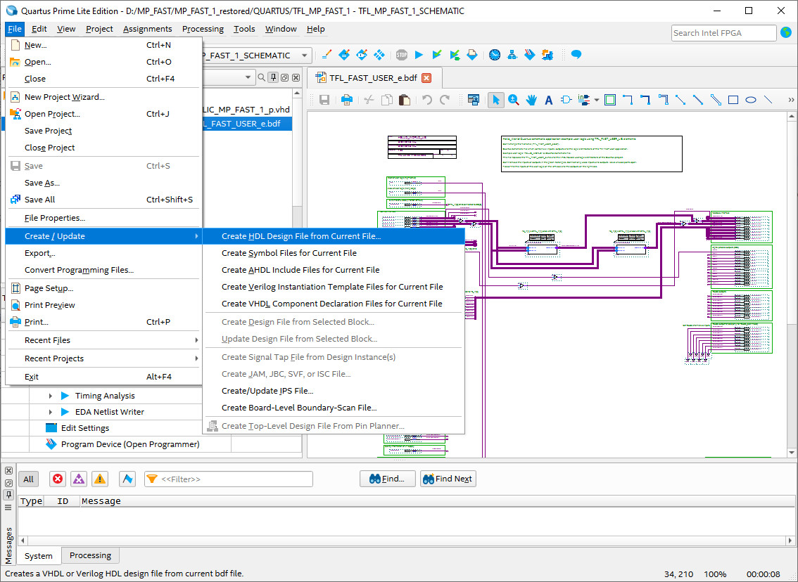

# How to use the TM_FAST_HELLO_WORLD_SCHEMATIC

## Quartus Project:
-   do all steps of the **TM FAST Library** descriptipn (READ_ME.md):
-	add the logic blocks of the **TM FAST Library** to your workspace: copy files of folder Questa and SRC of the **TM_FAST_LIBRARY** to your project folders with the same names (add link)
-	add the **license.dat** file to the Quartus License Setup ( see description **TM_FAST_LIBRARY**)
-   Copy files of folder Questa and SRC to your project folders with the same names
-	Open Quartus Project file TFL_MP_FAST_1.qpf
-	Switch to **TFL_MP_FAST_1_SCHEMATIC** revision of the project for Quartus Schematic development and add the TFL_FAST_USER_LIB.qip to the Quartus project
-	Go to files view in the Project Navigator in Quartus
-	Remove the current **TFL_FAST_USER_e.bdf** from the file list (Project Navigator view)
 
 

-	Add **TFL_FAST_USER_e.bdf** of the folder SRC/USER/SCHEMATIC/HELLO_WORLD/ to the file list in the Project Navigator in Quartus

 
 
 -	Now you can modify or compile the design
 
 

 

-	The HELLO_WORLD Schematic application example uses logic blocks of the TM FAST Library please find more informations in the TM FAST Library documentation. (Link einfügen)

The warnings “Pin … is missing source” or “Pin … not connected” will occur for unconnected Pins: 

*Warning (275043): Pin "FB_IF4[31..0]" is missing source* 
*Warning (275043): Pin "FB_IF5[31..0]" is missing source* 
*Warning (275043): Pin "FB_IF6[31..0]" is missing source* 
*Warning (275043): Pin "FB_IF7[31..0]" is missing source* 
*Warning (275043): Pin "RD_REC01[31..0]" is missing source* 
*Warning (275043): Pin "RD_REC02[31..0]" is missing source* 
*Warning (275043): Pin "RD_REC03[31..0]" is missing source* 
*Warning (275043): Pin "RD_REC04[31..0]" is missing source* 
*Warning (275043): Pin "RD_REC05[31..0]" is missing source* 
*Warning (275043): Pin "RD_REC06[31..0]" is missing source* 
*Warning (275043): Pin "RD_REC07[31..0]" is missing source* 
*Warning (275043): Pin "RD_REC08[31..0]" is missing source* 
*Warning (275043): Pin "RD_REC09[31..0]" is missing source* 
*Warning (275043): Pin "RD_REC10[31..0]" is missing source* 
*Warning (275043): Pin "RD_REC11[31..0]" is missing source* 
*Warning (275043): Pin "RD_REC12[31..0]" is missing source* 
*Warning (275043): Pin "RD_REC13[31..0]" is missing source* 
*Warning (275043): Pin "RD_REC14[31..0]" is missing source* 
*Warning (275043): Pin "RD_REC15[31..0]" is missing source* 
*Warning (275043): Pin "RD_REC16[31..0]" is missing source* 
*Warning (275043): Pin "RD_REC17[31..0]" is missing source* 
*Warning (275043): Pin "RD_REC18[31..0]" is missing source* 
*Warning (275043): Pin "RD_REC19[31..0]" is missing source* 
*Warning (275043): Pin "RD_REC20[31..0]" is missing source* 
*Warning (275043): Pin "RD_REC21[31..0]" is missing source* 
*Warning (275043): Pin "RD_REC22[31..0]" is missing source* 
*Warning (275043): Pin "RD_REC23[31..0]" is missing source* 
*Warning (275043): Pin "RD_REC24[31..0]" is missing source* 
*Warning (275043): Pin "RD_REC25[31..0]" is missing source* 
*Warning (275043): Pin "RD_REC26[31..0]" is missing source* 
*Warning (275043): Pin "RD_REC27[31..0]" is missing source* 
*Warning (275043): Pin "RD_REC28[31..0]" is missing source* 
*Warning (275043): Pin "RD_REC29[31..0]" is missing source* 
*Warning (275043): Pin "RD_REC30[31..0]" is missing source* 
*Warning (275043): Pin "RD_REC31[31..0]" is missing source* 
*Warning (275043): Pin "RS485_TX[7..0]" is missing source* 
*Warning (275009): Pin "LP_QI_BAD" not connected* 
*Warning (275009): Pin "CPU_STOP" not connected* 
*Warning (275009): Pin "T_I" not connected* 
*Warning (275009): Pin "T_O" not connected* 
*Warning (275009): Pin "T_DC" not connected* 
*Warning (275009): Pin "T_I_LATCH" not connected* 
*Warning (275009): Pin "T_O_LATCH" not connected* 
*Warning (275009): Pin "CTRL_IF3" not connected* 
*Warning (275009): Pin "CTRL_IF4" not connected* 
*Warning (275009): Pin "CTRL_IF5" not connected* 
*Warning (275009): Pin "CTRL_IF6" not connected* 
*Warning (275009): Pin "CTRL_IF7" not connected* 
*Warning (275009): Pin "DI_QI_BAD" not connected* 
*Warning (275009): Pin "DQ_QI_BAD" not connected* 
*Warning (275009): Pin "PHASE" not connected* 
*Warning (275009): Pin "RS485_QI_BAD" not connected* 
*Warning (275009): Pin "WR_REC01" not connected* 
*Warning (275009): Pin "WR_REC02" not connected* 
*Warning (275009): Pin "WR_REC03" not connected* 
*Warning (275009): Pin "WR_REC04" not connected* 
*Warning (275009): Pin "WR_REC05" not connected* 
*Warning (275009): Pin "WR_REC06" not connected* 
*Warning (275009): Pin "WR_REC07" not connected* 
*Warning (275009): Pin "WR_REC08" not connected* 
*Warning (275009): Pin "WR_REC09" not connected* 
*Warning (275009): Pin "WR_REC10" not connected* 
*Warning (275009): Pin "WR_REC11" not connected* 
*Warning (275009): Pin "WR_REC12" not connected* 
*Warning (275009): Pin "WR_REC13" not connected* 
*Warning (275009): Pin "WR_REC14" not connected* 
*Warning (275009): Pin "WR_REC15" not connected* 
*Warning (275009): Pin "WR_REC16" not connected* 
*Warning (275009): Pin "WR_REC17" not connected* 
*Warning (275009): Pin "WR_REC18" not connected* 
*Warning (275009): Pin "WR_REC19" not connected* 
*Warning (275009): Pin "WR_REC20" not connected* 
*Warning (275009): Pin "WR_REC21" not connected* 
*Warning (275009): Pin "WR_REC22" not connected* 
*Warning (275009): Pin "WR_REC23" not connected* 
*Warning (275009): Pin "WR_REC24" not connected* 
*Warning (275009): Pin "WR_REC25" not connected* 
*Warning (275009): Pin "WR_REC26" not connected* 
*Warning (275009): Pin "WR_REC27" not connected* 
*Warning (275009): Pin "WR_REC28" not connected* 
*Warning (275009): Pin "WR_REC29" not connected* 
*Warning (275009): Pin "WR_REC30" not connected* 
*Warning (275009): Pin "WR_REC31" not connected* 
*Warning (21074): Design contains 5 input pin(s) that do not drive logic* 
  *Warning (15610): No output dependent on input pin "SPI2_CLK"* 
	*Warning (15610): No output dependent on input pin "JTAG_EN"* 
	*Warning (15610): No output dependent on input pin "PER_UART1_TXD"* 
	*Warning (15610): No output dependent on input pin "TSU_PW[1]"* 
	*Warning (15610): No output dependent on input pin "TSU_PW[0]"* 

## Questa Simulation

-	do the steps mentioned in the chapter above (Quartus project)
-	generate a VHDL file in Quartus (with the name TFL_FAST_USER_e.vhd in the folder SRC/USER/SCHEMATIC/HELLO_WORLD/) out of the Quartus Schematic file TFL_FAST_USER_e.bdf 
-	Create/Update: Create HDL Design File from Current File
 
-	open the Questa project file TFL_FAST_USER.mpf 
-	run the do-script files in the following order to compile the sources(Questa Transcript commands): 
•	*do Setup_Sim_TM_FAST.do* 
•	*do Setup_TM_FAST_Library.do* 
•	*do Setup_User_Logic_HELLO_WORLD_GEN_VHDL.do* 
-	Start the simulation with: 
•	*do Start_Sim_HELLO_WORLD_GEN_VHDL.do* (the testbench ..\SRC\TFL_FAST_USER_EXAMPLE_HELLO_WORLD_GEN_VHDL_ta.vhd will be started) 

