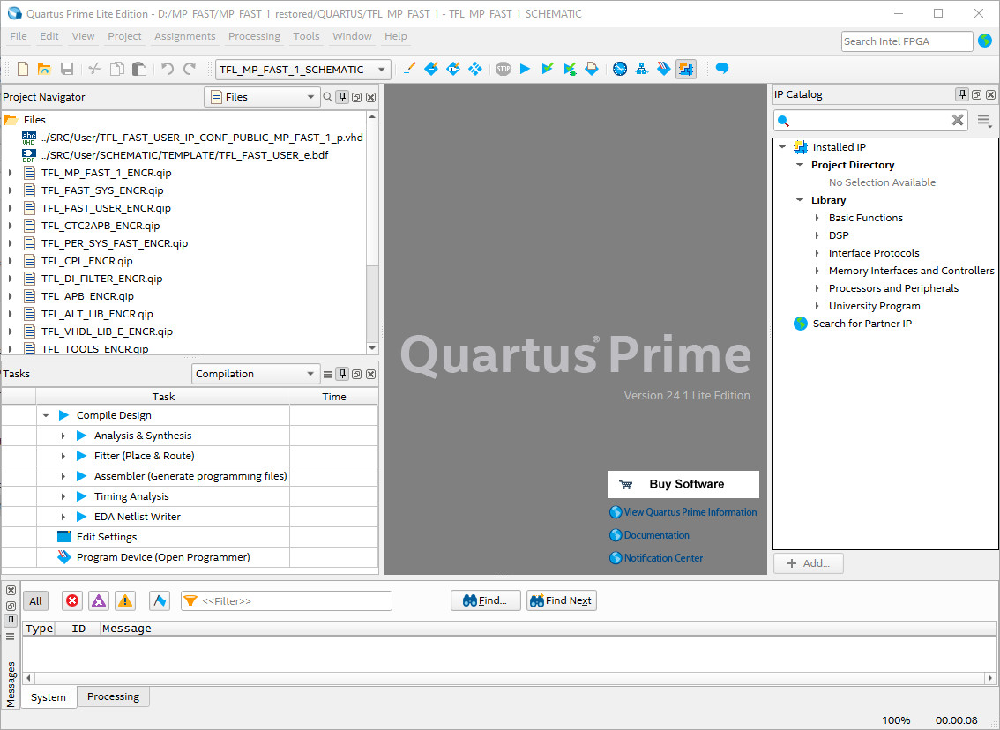
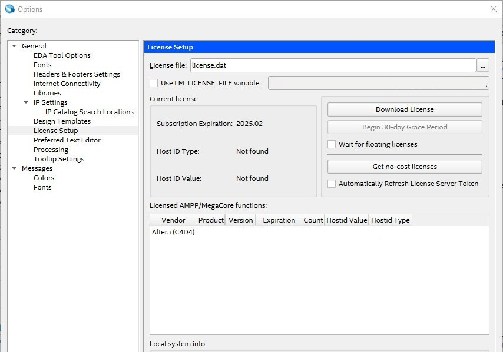

# How to use the logic blocks of the TM FAST Library

## Quartus Project

-	Copy the files of the folders Quartus, Questa and SRC to your project workspace folders
-	Open Quartus Project file TFL_MP_FAST_1.qpf
-	Switch to TFL_MP_FAST_1 revision for VHDL development or to TFL_MP_FAST_1_SCHEMATIC revision of the project for Quartus Schematic development
-	open files view in Project Navigator in Quartus

TFL_MP_FAST_1 revision filelist with TFL_FAST_USER_LIB.qip:

-	add TFL_FAST_USER_LIB.qip to the project (filelist in project navigator)

TFL_MP_FAST_1_SCHEMATIC revision filelist with TFL_FAST_USER_LIB.qip:

Add the license file of the TM FAST system logic to QUARTUS (license.dat in the Quartus folder):

-	now you can use the sources of the TM_FAST_LIBRARY in your user application

## In the Questa Simulation

-	copy Setup_TM_FAST_Library.do from the QUESTA folder to same folder of your workspace
-	open the Questa project file TFL_FAST_USER.mpf
-	to compile the TM FAST Library sources run the do-script: do Setup_TM_FAST_Library.do in Questa
